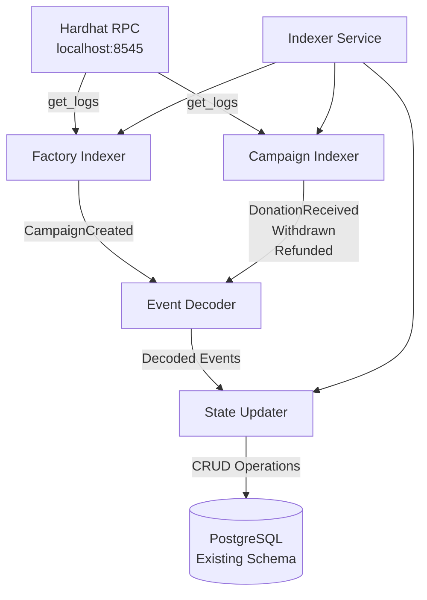

# Blockchain Indexer

Implementation Plan

## Overview

Implement a production-ready Python blockchain indexer that listens to Hardhat/local blockchain events and syncs them to an existing PostgreSQL database. The indexer must NEVER create tables or run migrations - it only performs CRUD operations on pre-existing schema.

## Architecture

## Implementation Tasks

### 1. Project Structure Setup

- Create `indexer/` package structure with all required subdirectories
- Set up `pyproject.toml` or `requirements.txt` with dependencies:
- `web3.py` (Ethereum client)
- `sqlalchemy` (ORM)
- `psycopg2-binary` (PostgreSQL driver)
- `python-dotenv` (config)
- `pytest` (testing)
- Create `__init__.py` files for package structure
- Create `__main__.py` to enable `python -m indexer` command

### 2. Configuration Module (`indexer/config.py`)

- Load environment variables:
- `RPC_URL` (default: `http://127.0.0.1:8545`)
- `FACTORY_ADDRESS` (required)
- `DB_URL` (PostgreSQL connection string)
- `CONFIRMATIONS` (default: 1 for localhost)
- `BLOCK_BATCH_SIZE` (default: 2000)
- `POLL_INTERVAL_SECONDS` (default: 2)
- `REORG_ROLLBACK_BLOCKS` (default: 50)
- `LOG_LEVEL` (default: INFO)
- Validate required config values
- Provide typed config object

### 3. Database Layer (`indexer/db/`)

#### 3.1 Session Management (`indexer/db/session.py`)

- Create global SQLAlchemy Engine with:
- Connection pooling (pool_size=10, max_overflow=20)
- `pool_pre_ping=True` for connection health checks
- Connection string from config
- Provide session factory function
- Implement context manager for short-lived sessions
- Ensure proper session cleanup (no leaks)

#### 3.2 ORM Models (`indexer/db/models.py`)

- Define SQLAlchemy models for existing tables:
- `Chain` (chains table)
- `SyncState` (sync_state table)
- `Campaign` (campaigns table)
- `Contribution` (contributions table)
- `Event` (events table)
- Models reflect existing schema (no `create_all()` calls)
- Include proper relationships and constraints
- Use appropriate column types (BigInteger for wei, String for addresses, etc.)

#### 3.3 Health Check (`indexer/db/healthcheck.py`)

- Function to verify all required tables exist
- Issue `SELECT 1 FROM table_name` for each required table
- Raise clear exception if any table missing:
- "DB schema missing. Run backend migrations first."
- Called at indexer startup

### 4. Ethereum Client Layer (`indexer/eth/`)

#### 4.1 Web3 Client (`indexer/eth/client.py`)

- Initialize Web3 connection to RPC_URL
- Handle connection retries with backoff
- Provide helper methods:
- `get_latest_block()` with confirmations
- `get_block_hash(block_number)`
- `get_logs(address, from_block, to_block, topics)`
- Error handling for RPC failures

#### 4.2 ABI Loader (`indexer/eth/abi_loader.py`)

- Load ABI JSON files from `indexer/abi/` directory:
- `CampaignFactory.json` (from Hardhat artifacts)
- `Campaign.json` (from Hardhat artifacts)
- Parse and return ABI dictionaries
- Handle missing ABI files gracefully

#### 4.3 Event Topics (`indexer/eth/topics.py`)

- Compute event topic hashes:
- `CampaignCreated` topic
- `DonationReceived` topic
- `Withdrawn` topic
- `Refunded` topic
- Use keccak256 hashing (web3.py utilities)

#### 4.4 Event Decoder (`indexer/eth/decoder.py`)

- Decode raw log data using ABI
- Parse indexed and non-indexed parameters
- Return structured event data:
- Event name
- Decoded parameters
- Block number, tx hash, log index
- Handle decoding errors gracefully

### 5. Indexing Pipeline (`indexer/pipeline/`)

#### 5.1 Factory Indexer (`indexer/pipeline/factory_indexer.py`)

- Poll for `CampaignCreated` events from Factory contract
- Process events in block batches
- For each `CampaignCreated`:
- Insert raw event into `events` table (idempotent)
- Upsert `campaigns` table:
    - `address` = campaign address
    - `factory_address` = factory address
    - `creator_address` = creator address
    - `goal_wei` = goal
    - `deadline_ts` = deadline
    - `cid` = IPFS CID
    - `status` = "ACTIVE"
    - `total_raised_wei` = 0
    - `withdrawn` = false
- Track processed blocks in sync_state

#### 5.2 Campaign Indexer (`indexer/pipeline/campaign_indexer.py`)

- Query DB for all known campaign addresses
- For each campaign, poll for events:
- `DonationReceived`
- `Withdrawn`
- `Refunded`
- Process events in block batches
- Insert raw events (idempotent)
- Delegate state updates to StateUpdater

#### 5.3 Reorg Handler (`indexer/pipeline/reorg.py`)

- On each block, check block_hash against stored hash
- If mismatch detected:
- Roll back N blocks (REORG_ROLLBACK_BLOCKS)
- Mark affected events as `removed=true`
- Trigger state rebuild for rolled-back range
- Implement rollback logic:
- Delete/update sync_state
- Mark events as removed
- Replay events to rebuild state

#### 5.4 Reconciler (`indexer/pipeline/reconciler.py`)

- Periodic reconciliation (every N loops):
- Query campaigns with `status="ACTIVE"` and `deadline_ts < now()`
- For each expired campaign:
    - If `total_raised_wei < goal_wei` and `not withdrawn`:
    - Update `status="FAILED"`
- Run as background task or periodic check

### 6. State Update Service (`indexer/services/state_updater.py`)

- Apply state updates based on event type:

**On DonationReceived:**

- Upsert `contributions`:
- `campaign_address` + `donor_address` unique
- `contributed_wei += amount`
- Update `campaigns`:
- `total_raised_wei = newTotalRaised`
- If `newTotalRaised >= goal_wei` and `status="ACTIVE"`:
    - `status = "SUCCESS"`

**On Withdrawn:**

- Update `campaigns`:
- `withdrawn = true`
- `withdrawn_amount_wei = amount`
- `status = "WITHDRAWN"`

**On Refunded:**

- Update `contributions`:
- `refunded_wei += amount`
- Keep `contributed_wei` as lifetime total (document this decision)
- Note: Status becomes "FAILED" via reconciler, not directly from Refunded event
- Use transactions for atomicity
- Handle idempotency (skip if event already processed)

### 7. Main Indexer Service (`indexer/main.py`)

- CLI argument parser:
- `run` - start polling indexer
- `backfill --from-block X --to-block Y` - backfill historical blocks
- `status` - show sync status
- Main polling loop:
- Get latest block with confirmations
- Check for reorgs
- Process Factory events
- Process Campaign events
- Update sync_state
- Run periodic reconciliation
- Sleep POLL_INTERVAL_SECONDS
- Progress tracking:
- Store last processed block in sync_state
- Handle graceful shutdown

### 8. Logging (`indexer/log.py`)

- Configure Python logging
- Use LOG_LEVEL from config
- Structured logging for:
- Block processing
- Event indexing
- State updates
- Errors and warnings

### 9. Testing (`indexer/tests/`)

#### 9.1 Test Setup

- Use pytest fixtures
- Create test database or use SQLite with preloaded schema
- Mock Web3 client for unit tests
- Test database must have schema pre-created (no migrations)

#### 9.2 Test Files

- `test_decoder.py`: Event decoding correctness
- `test_idempotency.py`: 
- Test duplicate event insertion (IntegrityError handling)
- Verify ON CONFLICT behavior
- Test state update idempotency
- `test_state_updates.py`:
- Test DonationReceived state updates
- Test Withdrawn state updates
- Test Refunded state updates
- Test campaign status transitions
- `test_reorg.py`:
- Simulate block_hash mismatch
- Test rollback logic
- Test state rebuild after rollback

### 10. ABI Files Setup

- Copy ABI files from `smartcontract/artifacts/` to `indexer/abi/`:
- `CampaignFactory.json`
- `Campaign.json`
- Extract just the `abi` field from Hardhat artifacts
- Ensure files are valid JSON

### 11. Documentation (`indexer/README.md`)

- Installation instructions
- Environment variables documentation
- How to run against Hardhat localhost
- How to verify indexer is writing rows
- **Explicit statement**: "Indexer does not create tables; run backend migrations first."
- Troubleshooting guide
- Database schema assumptions

## Key Implementation Details

### Idempotency Strategy

- Events table has unique constraint: `(chain_id, tx_hash, log_index)`
- On insert conflict, skip event (already processed)
- State updates check if event already processed before applying

### Connection Pooling

- Single global engine instance
- Short-lived sessions per batch
- Context managers ensure cleanup
- `pool_pre_ping=True` for connection health

### Error Handling

- Fail fast on missing tables (healthcheck)
- Retry with backoff for RPC failures
- Transaction rollback on state update errors
- Log all errors with context

### State Update Atomicity

- Each batch wrapped in transaction
- Commit only after all events processed and state updated
- Rollback on any error

## Files to Create

1. `indexer/__init__.py`
2. `indexer/__main__.py`
3. `indexer/main.py` - CLI entry point
4. `indexer/config.py` - Configuration
5. `indexer/log.py` - Logging setup
6. `indexer/db/__init__.py`
7. `indexer/db/session.py` - Database session management
8. `indexer/db/models.py` - ORM models
9. `indexer/db/healthcheck.py` - Schema validation
10. `indexer/eth/__init__.py`
11. `indexer/eth/client.py` - Web3 client
12. `indexer/eth/abi_loader.py` - ABI loading
13. `indexer/eth/topics.py` - Event topics
14. `indexer/eth/decoder.py` - Event decoding
15. `indexer/pipeline/__init__.py`
16. `indexer/pipeline/factory_indexer.py` - Factory event indexing
17. `indexer/pipeline/campaign_indexer.py` - Campaign event indexing
18. `indexer/pipeline/reorg.py` - Reorg handling
19. `indexer/pipeline/reconciler.py` - Periodic reconciliation
20. `indexer/services/__init__.py`
21. `indexer/services/state_updater.py` - State update logic
22. `indexer/tests/__init__.py`
23. `indexer/tests/test_decoder.py`
24. `indexer/tests/test_idempotency.py`
25. `indexer/tests/test_state_updates.py`
26. `indexer/tests/test_reorg.py`
27. `indexer/abi/CampaignFactory.json` - ABI file
28. `indexer/abi/Campaign.json` - ABI file
29. `indexer/README.md` - Documentation
30. `pyproject.toml` or `requirements.txt` - Dependencies

## Database Schema Assumptions

The indexer assumes these tables exist (with approximate schema):

- `chains`: `id`, `name`, `chain_id`, `rpc_url`
- `sync_state`: `chain_id`, `last_block`, `last_block_hash`, `updated_at`
- `campaigns`: `address`, `factory_address`, `creator_address`, `goal_wei`, `deadline_ts`, `cid`, `status`, `total_raised_wei`, `withdrawn`, `withdrawn_amount_wei`, `created_at`, `updated_at`
- `contributions`: `campaign_address`, `donor_address`, `contributed_wei`, `refunded_wei`, `created_at`, `updated_at`
- `events`: `id`, `chain_id`, `tx_hash`, `log_index`, `block_number`, `block_hash`, `address`, `event_name`, `event_data`, `removed`, `created_at`