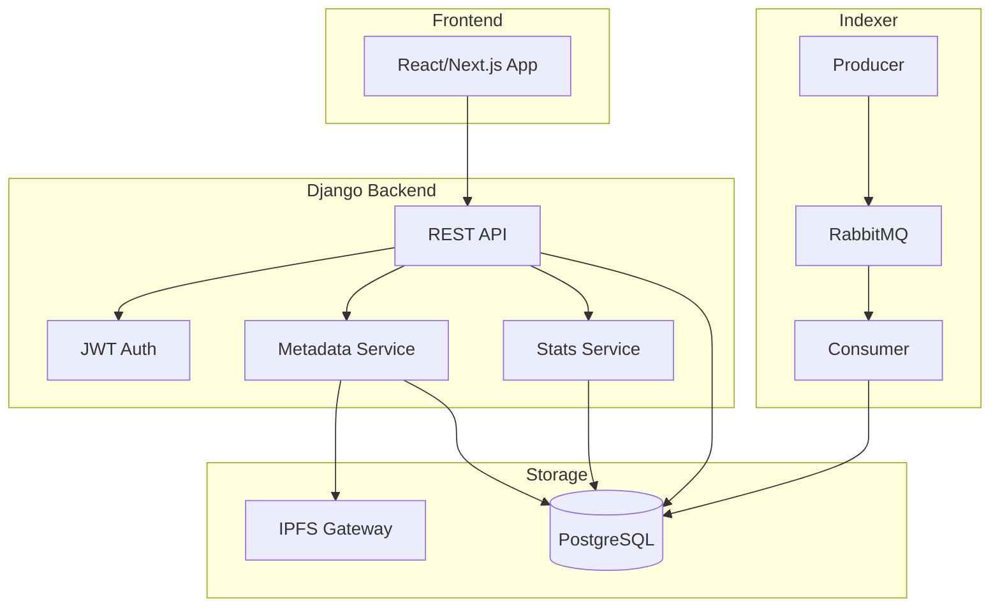

# Complete Backend Implementation Plan

## Current State

The backend already has:

- Django project structure ([backend/_base/](backend/_base/), [backend/core/](backend/core/))
- Models mapping to existing tables with `managed=False` ([backend/core/models.py](backend/core/models.py))
- Read-only REST API with filtering, pagination, search ([backend/core/api/](backend/core/api/))
- Admin panel with computed fields ([backend/core/admin.py](backend/core/admin.py))
- OpenAPI/Swagger documentation via drf-spectacular

---

## Development Notes

> **Virtual Environment**: Before running any command in the backend directory, activate the virtual environment:
>
> ```bash
> source .backend/bin/activate
> ```

> **Migrations**: Always prefer Django management commands for database migrations:
>
> ```bash
> # Create migrations after model changes
> python manage.py makemigrations
>
> # Apply migrations
> python manage.py migrate
>
> # Check migration status
> python manage.py showmigrations
> ```

---

## Phase 1: Campaign Metadata System (IPFS Integration)

This enables Kickstarter-like campaign pages with titles, descriptions, and images.

### 1.1 Database Schema Extension

Create new managed table for caching IPFS metadata:

```sql
-- New table (managed by Django migrations)
CREATE TABLE campaign_metadata (
    id SERIAL PRIMARY KEY,
    campaign_address VARCHAR(42) UNIQUE NOT NULL,
    cid VARCHAR(255) NOT NULL,
    name VARCHAR(255),
    description TEXT,
    short_description VARCHAR(500),
    image_cid VARCHAR(255),
    banner_cid VARCHAR(255),
    category VARCHAR(100),
    location VARCHAR(255),
    creator_name VARCHAR(255),
    creator_avatar_cid VARCHAR(255),
    website_url VARCHAR(512),
    twitter_handle VARCHAR(100),
    raw_json JSONB,
    ipfs_fetched_at TIMESTAMP,
    created_at TIMESTAMP DEFAULT NOW(),
    updated_at TIMESTAMP DEFAULT NOW(),
    FOREIGN KEY (campaign_address) REFERENCES campaigns(address)
);
```

### 1.2 New Files to Create

- [backend/core/models.py](backend/core/models.py) - Add `CampaignMetadata` model (managed=True)
- [backend/core/services/ipfs.py](backend/core/services/ipfs.py) - IPFS gateway client
- [backend/core/services/metadata_resolver.py](backend/core/services/metadata_resolver.py) - Fetch and cache metadata
- [backend/core/api/serializers.py](backend/core/api/serializers.py) - Add `CampaignMetadataSerializer`
- [backend/core/api/views.py](backend/core/api/views.py) - Add metadata endpoints

### 1.3 New API Endpoints

```
GET  /api/v1/campaigns/{address}/metadata/     - Get cached metadata
POST /api/v1/campaigns/{address}/metadata/refresh/  - Force refresh from IPFS
GET  /api/v1/campaigns/search/?q=rainforest    - Full-text search on name/description
GET  /api/v1/campaigns/?category=environment   - Filter by category
```

### 1.4 IPFS Gateway Configuration

Add to `.env`:

```
IPFS_GATEWAY_URL=https://ipfs.io/ipfs/
# Or use Pinata/NFT.Storage gateway
```

---

## Phase 2: Analytics and Statistics Endpoints

### 2.1 New Endpoints

```
GET /api/v1/stats/platform/
    - total_campaigns, total_raised_wei, total_contributors
    - active_campaigns, successful_campaigns, failed_campaigns

GET /api/v1/stats/trending/
    - Top campaigns by recent donations (last 24h/7d)
    - Campaigns close to goal

GET /api/v1/stats/leaderboard/campaigns/
    - Top campaigns by total_raised_wei
    - Filter by status, time period

GET /api/v1/stats/leaderboard/donors/
    - Top donors by total contributed
    - Anonymized if needed

GET /api/v1/stats/creator/{address}/
    - Creator statistics (campaigns count, total raised, success rate)
```

### 2.2 Implementation

- [backend/core/api/stats_views.py](backend/core/api/stats_views.py) - Statistics ViewSets
- [backend/core/api/stats_serializers.py](backend/core/api/stats_serializers.py) - Stats serializers
- Use Django ORM aggregations: `Sum`, `Count`, `Avg`
- Add database indexes for performance if needed

---

## Phase 3: Authentication System

### 3.1 JWT Authentication Setup

Dependencies to add:

```
djangorestframework-simplejwt>=5.3.0
```

### 3.2 Authentication Modes

```
Public endpoints (no auth required):
  - GET /api/v1/campaigns/
  - GET /api/v1/stats/
  - GET /api/v1/campaigns/{address}/metadata/

Protected endpoints (JWT required):
  - POST /api/v1/campaigns/{address}/metadata/refresh/
  - Admin/management endpoints (future)

Rate limiting:
  - Anonymous: 100 requests/minute
  - Authenticated: 1000 requests/minute
```

### 3.3 New Endpoints

```
POST /api/v1/auth/token/           - Get JWT token (username/password)
POST /api/v1/auth/token/refresh/   - Refresh JWT token
POST /api/v1/auth/register/        - User registration (optional)
```

### 3.4 Files to Modify

- [backend/_base/settings.py](backend/_base/settings.py) - Add JWT settings
- [backend/core/api/urls.py](backend/core/api/urls.py) - Add auth routes
- [backend/core/api/views.py](backend/core/api/views.py) - Add permission classes

---

## Phase 4: Integration and Polish

### 4.1 Update Existing Serializers

Modify `CampaignSerializer` and `CampaignDetailSerializer` to include:

- Nested metadata (name, description, image URLs)
- Resolved IPFS gateway URLs for images

### 4.2 Admin Panel Updates

- Add `CampaignMetadataAdmin` for viewing/managing metadata cache
- Add action to bulk-refresh metadata from IPFS

### 4.3 Configuration Updates

Update [backend/.env.example](backend/.env.example):

```
# IPFS
IPFS_GATEWAY_URL=https://ipfs.io/ipfs/
IPFS_FETCH_TIMEOUT=30

# JWT
JWT_ACCESS_TOKEN_LIFETIME_MINUTES=60
JWT_REFRESH_TOKEN_LIFETIME_DAYS=7

# Rate Limiting
RATE_LIMIT_ANON=100/minute
RATE_LIMIT_USER=1000/minute
```

---

## Architecture Diagram




---

## File Changes Summary


| File                                 | Action | Description                   |
| ------------------------------------ | ------ | ----------------------------- |
| `core/models.py`                     | Modify | Add CampaignMetadata model    |
| `core/services/__init__.py`          | Create | Services package              |
| `core/services/ipfs.py`              | Create | IPFS gateway client           |
| `core/services/metadata_resolver.py` | Create | Metadata fetch/cache logic    |
| `core/api/serializers.py`            | Modify | Add metadata serializers      |
| `core/api/views.py`                  | Modify | Add metadata/stats views      |
| `core/api/stats_views.py`            | Create | Statistics endpoints          |
| `core/api/stats_serializers.py`      | Create | Stats serializers             |
| `core/api/urls.py`                   | Modify | Add new routes                |
| `core/admin.py`                      | Modify | Add metadata admin            |
| `_base/settings.py`                  | Modify | Add JWT, rate limiting config |
| `requirements.txt`                   | Modify | Add new dependencies          |
| `.env.example`                       | Modify | Add new env vars              |


---

## Dependencies to Add

```
# requirements.txt additions
djangorestframework-simplejwt>=5.3.0
django-ratelimit>=4.1.0
httpx>=0.27.0  # For async IPFS requests
```

---

## Migration Strategy

Since `campaigns` table is unmanaged, the new `campaign_metadata` table will be:

- Created via Django migrations (managed=True)
- Has a foreign key to campaigns.address
- Can be dropped/recreated without affecting core blockchain data

