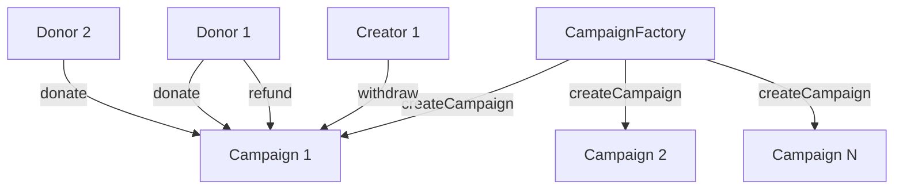

# Crowdfundin

g Smart Contracts Implementation Plan

## Overview

Implement a production-ready Solidity smart contract system for a hybrid Web2/Web3 crowdfunding platform using the Factory-Campaign pattern. Each campaign is deployed as an independent contract that handles donations, withdrawals, and refunds.

## Architecture

## Implementation Tasks

### 1. Project Setup

- Initialize Hardhat TypeScript project in `smartcontract/`
- Install dependencies: `@openzeppelin/contracts`, `hardhat`, `ethers`, `chai`, `@types/node`
- Configure `hardhat.config.ts` with Solidity ^0.8.20
- Set up TypeScript configuration
- Create directory structure: `contracts/`, `test/`, `scripts/`

### 2. Core Contracts

#### 2.1 Campaign.sol (`contracts/Campaign.sol`)

- State variables:
- `immutable creator` - campaign creator address
- `immutable goal` - fundraising target in wei
- `immutable deadline` - unix timestamp
- `immutable cid` - IPFS content identifier
- `uint256 public totalRaised` - total contributions
- `bool public withdrawn` - withdrawal flag
- `mapping(address => uint256) public contributions` - donor balances
- Functions:
- `constructor(address _creator, uint256 _goal, uint256 _deadline, string memory _cid)`
- `donate() payable` - with ReentrancyGuard, deadline check, zero-amount check
- `withdraw()` - creator-only, goal-met check, single-use, transfers contract balance
- `refund()` - donor-only, deadline-passed check, goal-not-met check, single-use per donor
- View functions: `getSummary()`, `contributionOf(address)`, `isActive()`, `isSuccessful()`, `isFailed()`
- Events:
- `DonationReceived(address indexed campaign, address indexed donor, uint256 amount, uint256 newTotalRaised, uint256 timestamp)`
- `Withdrawn(address indexed campaign, address indexed creator, uint256 amount, uint256 timestamp)`
- `Refunded(address indexed campaign, address indexed donor, uint256 amount, uint256 timestamp)`
- Security:
- Use OpenZeppelin `ReentrancyGuard`
- Custom errors for gas efficiency
- Checks-Effects-Interactions pattern
- Use `call{value: ...}("")` for ETH transfers

#### 2.2 CampaignFactory.sol (`contracts/CampaignFactory.sol`)

- State variables:
- `Campaign[] public campaigns` - array of deployed campaign addresses
- `mapping(address => Campaign[]) public campaignsByCreator` - optional creator lookup
- Functions:
- `createCampaign(uint256 goal, uint256 deadline, string memory cid) returns (Campaign)`
    - Validates goal > 0, deadline > block.timestamp, cid non-empty
    - Deploys new Campaign contract
    - Stores campaign address
    - Emits `CampaignCreated`
- `getCampaigns() returns (Campaign[])` - returns all campaigns
- `getCampaignsByCreator(address creator) returns (Campaign[])` - optional helper
- Events:
- `CampaignCreated(address indexed factory, address indexed campaign, address indexed creator, uint256 goal, uint256 deadline, string cid)`

### 3. Test Suite (`test/Campaign.test.ts` and `test/CampaignFactory.test.ts`)

#### Factory Tests:

- Deploy factory successfully
- Create campaign with valid parameters
- CampaignCreated event emission with correct fields
- Campaign stored in campaigns array
- Reject invalid goal (0)
- Reject invalid deadline (past timestamp)
- Reject empty CID
- getCampaigns() returns correct list

#### Campaign Tests:

- **Donation:**
- Accept valid donation before deadline
- Update contributions mapping correctly
- Update totalRaised correctly
- Emit DonationReceived with correct fields
- Accept multiple donations from same address
- Reject zero-amount donation
- Reject donation after deadline
- Reject donation when campaign closed
- **Withdrawal:**
- Creator can withdraw when goal met
- Withdraw transfers correct amount
- Sets withdrawn flag
- Emits Withdrawn event
- Reject withdrawal by non-creator
- Reject withdrawal when goal not met
- Reject duplicate withdrawal
- Reject withdrawal before goal met
- **Refund:**
- Donor can refund after deadline if goal not met
- Refund returns correct amount
- Zeros contribution mapping
- Emits Refunded event
- Reject refund before deadline
- Reject refund when goal met
- Reject duplicate refund
- Reject refund by non-contributor
- **View Functions:**
- getSummary() returns correct data
- contributionOf() returns correct amounts
- isActive() returns true before deadline
- isSuccessful() returns true when goal met
- isFailed() returns true after deadline if goal not met
- **Reentrancy:**
- Test with malicious contract attempting reentrancy attack
- Verify ReentrancyGuard protection

### 4. Deployment Script (`scripts/deploy.ts`)

- Deploy CampaignFactory
- Create example campaign with sample parameters
- Demonstrate donation to example campaign
- Log deployed addresses and campaign details

### 5. Configuration Files

- `hardhat.config.ts`: Solidity compiler config, network settings, TypeScript support
- `package.json`: Scripts for `test`, `compile`, `deploy`, `coverage`
- `tsconfig.json`: TypeScript configuration for Hardhat

### 6. Documentation (`README.md`)

- Project overview
- Prerequisites (Node.js, npm)
- Installation steps
- Local development setup (Hardhat node)
- Deployment instructions
- Testing instructions
- Contract architecture explanation
- Event structure for indexer integration
- Security considerations

## Key Implementation Details

### State Machine Logic

- **Active**: Campaign is accepting donations (before deadline, not withdrawn)
- **Success**: `totalRaised >= goal` (withdraw allowed)
- **Failure**: `deadline passed && totalRaised < goal` (refunds allowed)
- **Closed**: `withdrawn == true` OR after refunds processed

### Success Determination

- Success is determined when `totalRaised >= goal` (can happen before deadline)
- Withdrawal allowed immediately when goal met
- Refunds only allowed after deadline AND only if `totalRaised < goal`

### Gas Optimization

- Use `immutable` for creator, goal, deadline, cid
- Use custom errors instead of revert strings
- Minimize storage operations
- Efficient event structure

## Files to Create

1. `contracts/Campaign.sol` - Main campaign contract
2. `contracts/CampaignFactory.sol` - Factory contract
3. `test/Campaign.test.ts` - Campaign contract tests
4. `test/CampaignFactory.test.ts` - Factory contract tests
5. `scripts/deploy.ts` - Deployment script
6. `hardhat.config.ts` - Hardhat configuration
7. `package.json` - Dependencies and scripts
8. `tsconfig.json` - TypeScript configuration
9. `README.md` - Documentation
10. `.gitignore` - Git ignore file

## Testing Strategy