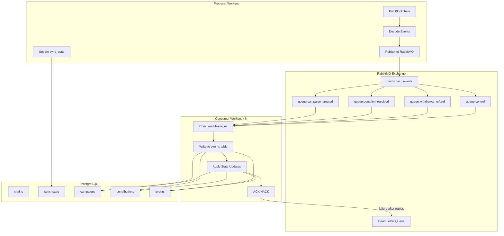

# RabbitMQ Blockchain Indexer Refactoring Plan

## Architecture Overview




## What Changes vs Current Implementation


| Component       | Current                  | New                            |
| --------------- | ------------------------ | ------------------------------ |
| Architecture    | Monolithic               | Producer/Consumer via RabbitMQ |
| DB writes       | Producer writes directly | Only consumers write           |
| Scaling         | Single process           | Multiple consumer workers      |
| Fault tolerance | None                     | Messages persist in queue      |
| Dependencies    | web3, sqlalchemy         | + pika, pydantic               |


## Files to Create/Modify

### New Files (16 files)

**Messaging Layer** (`indexer/messaging/`)

- `__init__.py` - Package init
- `rabbitmq.py` - RabbitMQ connection, publish, consume helpers
- `schema.py` - Pydantic models for message validation
- `routing.py` - Routing key constants and helpers

**Producer** (`indexer/producer/`)

- `__init__.py` - Package init
- `main.py` - Producer main loop and CLI
- `factory_indexer.py` - Fetch/publish Factory events (adapted from [pipeline/factory_indexer.py](indexer/pipeline/factory_indexer.py))
- `campaign_indexer.py` - Fetch/publish Campaign events
- `reorg_detector.py` - Detect reorgs and publish rollback messages
- `publisher.py` - Publish messages to RabbitMQ with confirm_delivery

**Consumer** (`indexer/consumer/`)

- `__init__.py` - Package init
- `main.py` - Consumer main loop with worker pool
- `event_handler.py` - Dispatch messages to handlers
- `state_updater.py` - Apply state updates (adapted from [services/state_updater.py](indexer/services/state_updater.py))
- `rollback_handler.py` - Process rollback messages
- `reconciliation_handler.py` - Process reconciliation messages

### Modified Files (5 files)

- `indexer/cli.py` - New CLI with producer/consumer/broker subcommands
- `indexer/__main__.py` - Update to use new CLI
- `indexer/requirements.txt` - Add pika, pydantic
- `indexer/.env.example` - Add RabbitMQ config vars
- `indexer/README.md` - Complete rewrite with new architecture

### Docker/Config Files (2 files)

- `stuff-crowd-funding/docker-compose.yaml` - Add RabbitMQ service
- `indexer/docker-compose.yml` - Standalone docker-compose for indexer dev

## Implementation Details

### 1. Message Schema (Pydantic)

```python
# indexer/messaging/schema.py
class EventMessage(BaseModel):
    message_type: Literal["event"] = "event"
    event_type: Literal["CampaignCreated", "DonationReceived", "Withdrawn", "Refunded"]
    chain_id: int
    block_number: int
    block_hash: str
    tx_hash: str
    log_index: int
    address: str
    timestamp: int
    event_data: dict
    published_at: datetime

class RollbackMessage(BaseModel):
    message_type: Literal["rollback"] = "rollback"
    chain_id: int
    from_block: int
    to_block: int
    reason: str
    published_at: datetime
```

### 2. RabbitMQ Configuration

**Exchange**: `blockchain_events` (topic, durable)

**Routing Keys**:

- `event.campaign_created`
- `event.donation_received`
- `event.withdrawn`
- `event.refunded`
- `control.rollback`
- `control.reconciliation`

**Queues** (all durable):

- `queue.campaign_created` binds to `event.campaign_created`
- `queue.donation_received` binds to `event.donation_received`
- `queue.withdrawal_refund` binds to `event.withdrawn`, `event.refunded`
- `queue.control` binds to `control.*`
- `dlq.events` - Dead letter queue for failed messages

### 3. CLI Commands

```bash
# Producer commands
python -m indexer producer run
python -m indexer producer backfill --from-block 0 --to-block 100
python -m indexer producer status

# Consumer commands
python -m indexer consumer run --workers 4
python -m indexer consumer status

# Broker management
python -m indexer broker setup      # Create exchanges/queues
python -m indexer broker status     # Show queue depths
python -m indexer broker purge --queue queue.campaign_created
```

### 4. Producer Flow

1. Poll blockchain for new blocks
2. Fetch logs from Factory contract
3. Decode events using existing [eth/decoder.py](indexer/eth/decoder.py)
4. Serialize to Pydantic `EventMessage`
5. Publish to RabbitMQ with `confirm_delivery()`
6. Update `sync_state` table (producer's only DB write)
7. Check for reorgs, publish `RollbackMessage` if detected

### 5. Consumer Flow

1. Subscribe to all event queues
2. Consume message, deserialize with Pydantic
3. Begin DB transaction
4. Insert into `events` table (idempotent via unique constraint)
5. Apply state update based on event type
6. Commit transaction
7. `basic_ack()` only after successful commit
8. On transient error: `basic_nack(requeue=True)`
9. After MAX_RETRIES: send to DLQ, acknowledge original

### 6. Environment Variables (New)

```env
# RabbitMQ
RABBITMQ_HOST=localhost
RABBITMQ_PORT=5672
RABBITMQ_USER=guest
RABBITMQ_PASSWORD=guest
RABBITMQ_VHOST=/
RABBITMQ_EXCHANGE=blockchain_events
RABBITMQ_PREFETCH_COUNT=10

# Consumer
CONSUMER_WORKERS=4
MAX_RETRIES=3

# Reconciliation
RECONCILIATION_INTERVAL_SECONDS=300
```

### 7. Docker Compose Addition

```yaml
rabbitmq:
  image: rabbitmq:3-management
  container_name: crowdfunding_rabbitmq
  ports:
    - "5672:5672"   # AMQP
    - "15672:15672" # Management UI
  environment:
    RABBITMQ_DEFAULT_USER: guest
    RABBITMQ_DEFAULT_PASS: guest
  volumes:
    - rabbitmq_data:/var/lib/rabbitmq
```

### 8. Dependencies to Add

```
pika>=1.3.2
pydantic>=2.5.0
```

## Key Reusable Code

The following existing code will be reused with minimal changes:

- [eth/client.py](indexer/eth/client.py) - Web3 client (no changes)
- [eth/decoder.py](indexer/eth/decoder.py) - Event decoding (no changes)
- [eth/topics.py](indexer/eth/topics.py) - Topic hashes (no changes)
- [eth/abi_loader.py](indexer/eth/abi_loader.py) - ABI loading (no changes)
- [db/models.py](indexer/db/models.py) - ORM models (no changes)
- [db/session.py](indexer/db/session.py) - Session management (no changes)
- [db/healthcheck.py](indexer/db/healthcheck.py) - Table verification (no changes)
- [services/state_updater.py](indexer/services/state_updater.py) - State logic moved to consumer

## Deployment Order

1. Start RabbitMQ: `docker-compose up -d rabbitmq`
2. Setup broker: `python -m indexer broker setup`
3. Start consumers: `python -m indexer consumer run --workers 4`
4. Start producer: `python -m indexer producer run`

